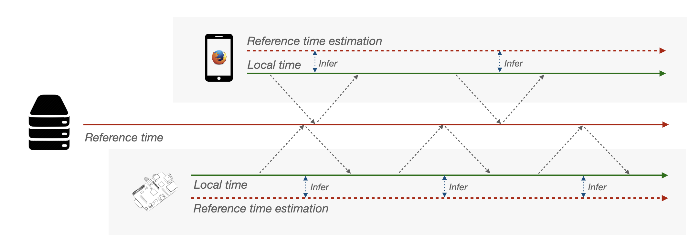
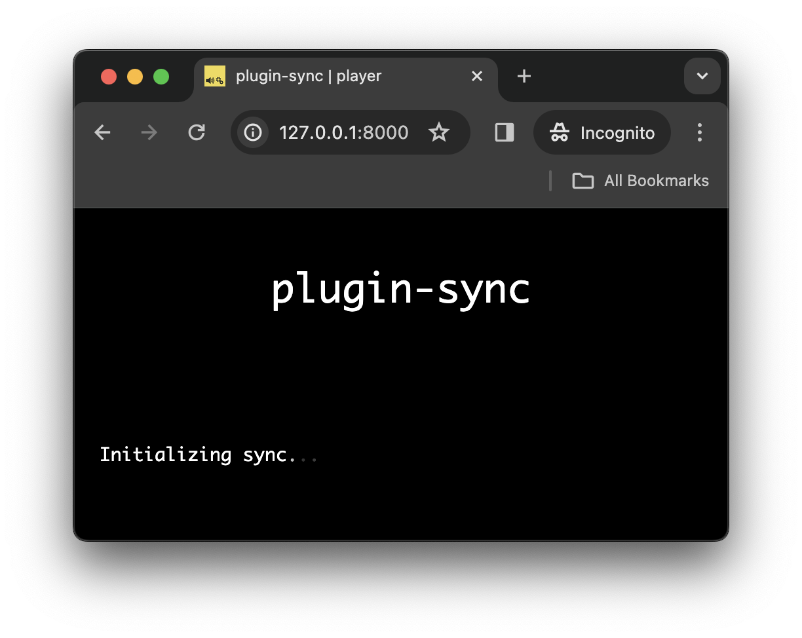

# Using Plugins 2 - The _sync_ Plugin

In this tutorial, we will dig into a very important problem when dealing with distributed system for music creation, i.e. how to synchronize our musical / audio events across the different devices that compose our system.

After a short introduction on why this can be an issue and of the underlying concepts involved in synchronizing devices on a network, we will learn how to use the [`@soundworks/plugin-sync`](https://github.com/collective-soundworks/soundworks-plugin-sync) plugin which is proposed to solve this particular issue.

### Related documentation

- [@soundworks/plugin-sync](https://github.com/collective-soundworks/soundworks-plugin-sync)
- [Synchronisation for Distributed Audio Rendering over Heterogeneous Devices, in HTML5](https://hal.science/hal-01304889v1) 

## Introduction

First of all let's start with a bit of theory to understand the general concepts and theory behing the _sync_ plugin.

### The "Why"

An important thing to understand when working with system composed of multiple devices is that each of them will live into a different timeline. Or to say it in a more formal way:

> _« An important observation is that, as a consequence of dealing with independent nodes, **each one will have its own notion of time**. In other words, we cannot assume that there is something like a global clock. This lack of a common reference of time leads to fundamental questions regarding the synchronization and coordination within a distributed system. »_ Maarten van Steen, and Andrew S. Tanenbaum. “A Brief Introduction to Distributed Systems.” Computing 98, no. 10, October 2016.

Indeed, each device have different physical clocks, each of them having a different time origin and furthermore a different speed. Most of the time, i.e. when we use our computers in our daily life, this is something we don't perceive as users, but only because our computers are constently synchronizing themselves with distant reference clocks through the network, using the Network Time Protocol (NTP).

We could consider at this that the problem is solved, i.e. let's use NTP! But unfortunately the problem is a bit more complicated in our context. 

First, we cannot always assume that our devices will be connected to the Internet and thus able to connect to a NTP server. Indeed, in many situations, you will have to and/or want to create you own local network, and this, for several reasons: e.g. the venue where your artwork is presented has a poor network installation, you want to have some control over what happen on the network to make sure the bandwidth is properly used, etc.

Second, when you want to produce sounds in a synchronized way, the clocks that are of interest for you are not the _system clocks_ but the _audio clocks_. Furthermore, we cannot assume that these two clocks, the system and the audio clocks, 1. share the same origin, e.g. the origin of `AudioContext.currentTime` is defined as when the context is created, and 2. that they even advance at the same speed, i.e. this is likely that the system and the soundcard won't share the same physical clock.

For all these reason, it is important in our context to have some way of synchronizing _arbitrary clocks_ without relying on external resources such as a NTP server.

### The "How"

On a more practical manner, we can thus consider that when trying to synchornize 2 clocks, we face a problem that be can express in the following form:

- **T<sub>clock1</sub> = a * T<sub>clock2</sub> + b**

Where:
- _a_ is the speed difference between the two clocks, i.e. their _drift_
- _b_ is the origin offset, i.e. the delta time between their respective origin

For the sake of keeping things simple, in this tutorial, we will consider the ideal case where 1. the respective speed of the clocks is excatly the same, i.e. `a = 1` and 2. the time of the propagation of a message on the network is constant (disclaimer, none of these assumptions are true in real life...). Hence, the goal will be to estimate _b_ so that we can calculate _T<sub>clock1</sub>_ from _T<sub>clock2</sub>_ and inversely.

To achieve that, we need a clock that we consider as a reference, in our case the more simple is to use a clock provided by the server as all clients are connected to it. Then, as shown in the figure below, the clients will periodically asks the server for its current time, to calculate the offset of their respective clocks:




More precisely at each iteration:
1. The client takes it current time (_t<sub>ping</sub>_), 
2. The client sends a message to server which takes its time tag at message reception (_T<sub>ping</sub>_)
3. Then, the server sends back a time tagged message to the client (_T<sub>pong</sub>_)
4. The client takes its local time (_t<sub>pong</sub>_) at reception of the message from the server.


Hence if we consider that the travel time of the ping / pong messages are the same, we can compute the _offset_ between the 2 clocks as the following:
- T<sub>reference</sub> = (T<sub>pong</sub> - T<sub>ping</sub>) / 2
- t<sub>local</sub> = (t<sub>pong</sub> - t<sub>ping</sub>) / 2
- offset = t<sub>local</sub> - T<sub>reference</sub>

From this point, it is then possible for all clients of our network, to calculate a local estimation of the server clock. With such information, it is therefore possible for our clients to schedule audio or musical events in the same infered time reference, while scheduling the actual audio synthesis in their own local audio time.

While this explanation is indeed simplified, we hope it gives you some intuition on the logic behind the synchronization process between different nodes on a network.

Let's now experiement with the `@soundworks/plugin-sync` to see how all these ideas translate into code.

## Scaffolding the application

First thing first, let's create a new project using the _soundworks_ wizard:

```sh
cd /path/to/working/directory
npx @soundworks/create@latest plugin-sync
```

When the wizard will ask you to select the plugins you would like to install, select the `@soundworks/plugin-platform-init` and the `@soundworks/plugin-sync`:


Then, when the wizard will ask you for the configuration of the default client:
- Name it `player`
- Select the `browser` target
- Select the `default` template


Finally, open the new `plugin-sync` directory in your favorite editor and launch the application in development mode:

```sh
cd plugin-sync
npm run dev
```

## Using the _sync_ plugin

### Register the plugin

Now that eveything is ready let's start with installing our plugin both on the server and on the client side.

Open the `src/server/index.js` file and add the following code:

```js
// src/server/index.js
import '@soundworks/helpers/polyfills.js';
import { Server } from '@soundworks/core/server.js';
import pluginSync from '@soundworks/plugin-sync/server.js'; // [!code ++]

// ...

const server = new Server(config);
// configure the server for usage within this application template
server.useDefaultApplicationTemplate();
// register plugins
server.pluginManager.register('sync', pluginSync); // [!code ++]
```

Then on the client-side, in the `src/clients/player/index.js`:

```js
// src/clients/player/index.js
import '@soundworks/helpers/polyfills.js';
import { Client } from '@soundworks/core/client.js';
import launcher from '@soundworks/helpers/launcher.js';
import pluginSync from '@soundworks/plugin-sync/client.js'; // [!code ++]

// ...

const client = new Client(config);
// register plugins
client.pluginManager.register('sync', pluginSync); // [!code ++]
```

If you launch a client, i.e. [http://127.0.0.1:8000](http://127.0.0.1:8000), you should now see at startup of the client, a screen telling you that the synchronizing process is on going:


Finally, let's add a bit code code to display the current reference time as estimated by the client, alongside it's local time:

```js
// src/clients/player/index.js
await client.start();
// retrieve the sync plugin instance
const sync = await client.pluginManager.get('sync'); // [!code ++]

function renderApp() {
  render(html`
    <div class="simple-layout">
      <p>localTime: ${sync.getLocalTime()}</p> // [!code ++]
      <p>syncTime: ${sync.getSyncTime()}</p> // [!code ++]

      <sw-credits .infos="${client.config.app}"></sw-credits>
    </div>
  `, $container);

  // refresh the screen at 60 fps // [!code ++]
  window.requestAnimationFrame(renderApp); // [!code ++]
}

renderApp();
```

If you now open, several browser windows side by side, you should how the synchronization process allows to estimate a common reference clock (i.e. `syncTime`) alongside a local clock (i.e. `localTime`):


## Synchronizing the audio context

So far so good, but what we are interested in is too synchronize the clock of an `AudioContext` to synchronize our synthesis, but so far we don't have yet created any `AudioContext`, so what can we do with this synchronization process? Indeed, by default, the _sync_ plugin just use a default clock which is either [`Date.now`](https://developer.mozilla.org/docs/Web/JavaScript/Reference/Global_Objects/Date/now) or [`performance.now`](https://developer.mozilla.org/docs/Web/API/Performance/now) depending on the context.

However, it is indeed possible to it another clock, such as [`AudioContext.currentTime`](https://developer.mozilla.org/en-US/docs/Web/API/BaseAudioContext/currentTime) against which the synchronization process should be done. So, let's thus use implement that.

First, let's then install the `@soundworks/plugin-platform-init` plugin which will allow us to resume the `AudioContext` and thus have a working clock. Indeed, if we used an `AudioContext` in default `suspended` state, the current time would always be zero, then the synchronization would fail...

Let's add the following code in the `src/server/index.js` file:

```js
// src/server/index.js
import { Server } from '@soundworks/core/server.js';
import pluginPlatformInit from '@soundworks/plugin-platform-init/server.js'; // [!code ++]
import pluginSync from '@soundworks/plugin-sync/server.js';

// ...

server.pluginManager.register('platform-init', pluginPlatformInit); // [!code ++]
server.pluginManager.register('sync', pluginSync);
```

And the following on the client side, to resume our `AudioContext` when the user clicks on the screen:

```js
// src/clients/player/index.js
import pluginPlatformInit from '@soundworks/plugin-platform-init/client.js';
import pluginSync from '@soundworks/plugin-sync/client.js';

// ...

const config = window.SOUNDWORKS_CONFIG;
// create an new audio context instance
const audioContext = new AudioContext();

// ...

const client = new Client(config);
// register plugins
client.pluginManager.register('platform-init', pluginPlatformInit, {
  audioContext
});
client.pluginManager.register('sync', pluginSync);
```
 
Finally, let configure further the _sync_ plugin so that it uses the clock provided by the `AudioContext` and starts the synchronization process only when the audio context is properly resumed:

```js
// src/clients/player/index.js
client.pluginManager.register('sync', pluginSync); // [!code --]
client.pluginManager.register('sync', pluginSync, { // [!code ++]
  // use the audio context clock // [!code ++]
  getTimeFunction: () => audioContext.currentTime, // [!code ++]
  // declare the 'platform-init' plugin as a dependency, so that the // [!code ++]
  // sync process starts only when the audio context is resumed // [!code ++]
}, ['platform-init']); // [!code ++]
```

And that's all, we now have a synchronization process estimating the server reference time using the clock provided by our audio context.

## Conclusion

In this tutorial, you have learned the reasons and general concepts behind clock synchronization in a distributed system, and learned how to use the _sync_ plugin provided by _soundworks_ to achieve such synchronization.

In the next tutorial, we will go further and use this new tool in a more musical way by implemeting a distributed step sequencer.


